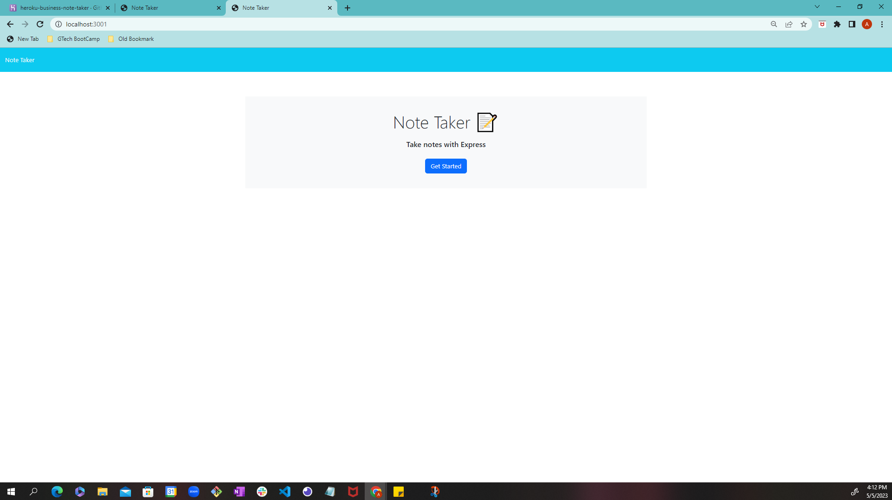
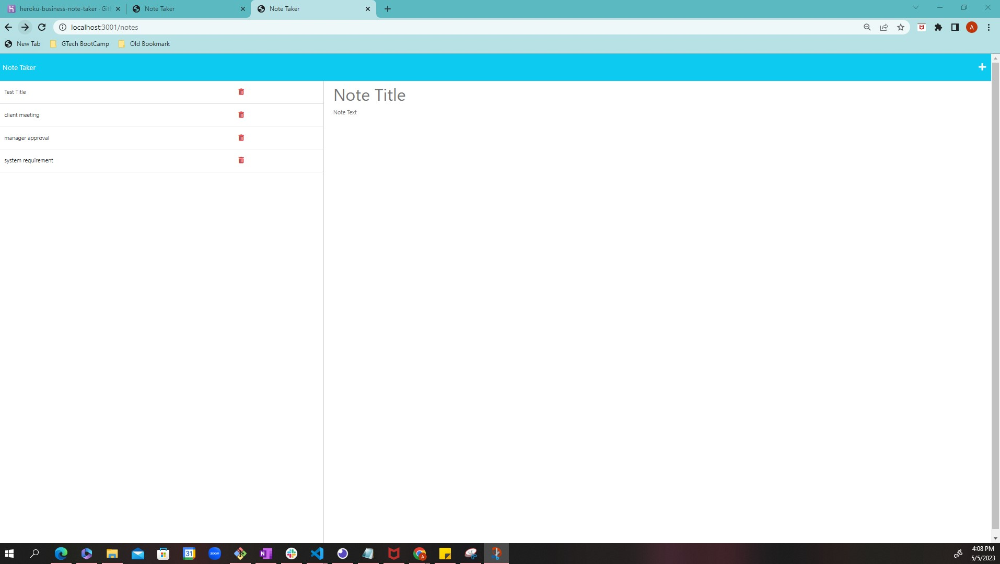

# 11 Note Taker
## Table of contents
- Overview
    - The Challenge
    - Screenshot
    - Links
- My Approach
    - Code construction
    - Learnings
- Author
## Overview

### The Challenge

GIVEN a note-taking application
WHEN I open the Note Taker
THEN I am presented with a landing page with a link to a notes page
WHEN I click on the link to the notes page
THEN I am presented with a page with existing notes listed in the left-hand column, plus empty fields to enter a new note title and the note’s text in the right-hand column
WHEN I enter a new note title and the note’s text
THEN a Save icon appears in the navigation at the top of the page
WHEN I click on the Save icon
THEN the new note I have entered is saved and appears in the left-hand column with the other existing notes
WHEN I click on an existing note in the list in the left-hand column
THEN that note appears in the right-hand column
WHEN I click on the Write icon in the navigation at the top of the page
THEN I am presented with empty fields to enter a new note title and the note’s text in the right-hand column

## Screenshot

The following image shows the web application's appearance and functionality:

### Links
Github URL : https://github.com/amalahema/note_taker

## My Approach

### Code Construction
- Javascript,Html,CSS 
- middleware express & node.js 
- database db.json
- Heroku

### Learnings

  - How to use the express library and set the individual router for each webpage in router.js
  - How to import the functionality of each router to the server in the router.js
  - How to access the router in the server.js
  - How the server connects with the front end index.js  file through fetch 
  - How to add GitHub rep and deploy the webpage in the Heroku platform
  - How to  get, post and delete data by HTTP request and response
  
